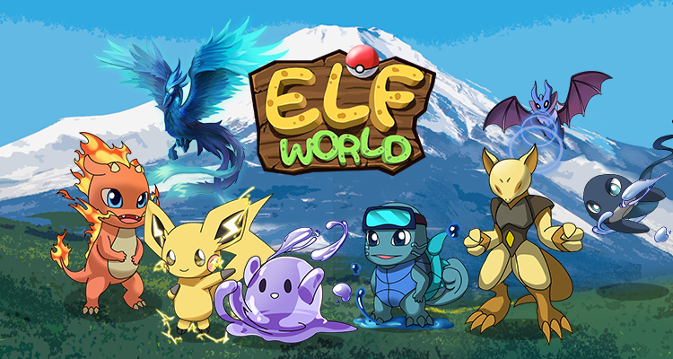

# 歡迎來到精靈世界！

精靈是小精靈是**按照ERC-721標準鑄造**的**NFT角色**，可以在我們的市場上交易。玩家可以使用精靈球來收集精靈，通過訓練、決鬥等策略獲得**ELFT 。**更多好玩的應用場景即將開啟。

遊戲運行在**BSC（Binance Chain）網路上**，這將確保**交易成本非常低。**相容MetaMask等 web3 錢包，用於接受交易和支付 gas 費用。MetaMask可以作為流覽器擴展安裝，也可以作為移動設備上的應用程式安裝。

&#x20;
