# NFT角色

它具有使死者復活的神話般的力量。它是唯一已知的學習神聖之火的精靈，這是它以前的標誌性動作。據說，當它飛翔時，它巨大的翅膀會形成明亮多彩的彩虹。極少數見證它的人被許諾永恆的幸福。

### 鳳王（Ho-Oh）  

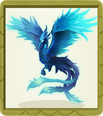

它具有復活逝者的小精靈。 在它飛過的地方會形成彩虹。 傳說看到它的人會獲得永遠的幸福。 在鐘之塔（即燒焦塔前身）被燒毀前，它在鈴鈴塔頂棲息。 據推測，它在其後一直飛翔於天空，尋找內心純潔的人。



| 類型  | 數值          |
| --- | ----------- |
| 屬性  | 火           |
| 稀有度 | UR          |
| 身高  | 3.8m        |
| 體重  | 199.0kg     |
| 進化  | 鳳王→火鳳王→青焰鳳王 |



| 類型           | 數值    |
| ------------ | ----- |
| 戰鬥力（AKT）     | 21737 |
| 生命值 （HP）     | 15140 |
| 潛力值 （POT）    | 80    |
| 耐力 （STA）     | 1514  |
| 耐力成長（_+sta_） | 30.3  |
| 力量 （STR）     | 1478  |
| 力量成長（_+str_） | 36.5  |
| 敏捷 （AGI）     | 2536  |
| 敏捷成長（_+agi_） | 44.6  |
| 智力（INT）      | 2690  |
| 智力成長（_+int_） | 36.5  |
| 傷害（DAM）      | 5400  |
| 魔抗（ADF）      | 2690  |
| 護甲（ARM）      | 1477  |
| 抗暴（CRE）      | 739   |
| 暴擊（CRI）      | 1268  |
| 閃避（EVA）      | 1080  |
| 命中（HIT）      | 757   |
| 速度（SPE）      | 2536  |



| 類型 | 數值          |
| -- | ----------- |
| 蛋群 | 阿爾法         |
| 性別 | 雄性 : 雌性=1:1 |



| 技能名稱   | 技能描述                                   |
| ------ | -------------------------------------- |
| 神聖之火   | 對敵方血量較少的2個目標造成100%火屬性傷害，一定概率灼燒目標，持續2回合 |
| 神聖之火·Ⅰ | 對敵方血量較少的2個目標造成100%火屬性傷害，高概率灼燒目標，持續2回合  |
| 神聖之火·Ⅱ | 對敵方血量較少的2個目標造成100%火屬性傷害，必定灼燒目標，持續2回合   |
| 神鳥猛擊   | 對敵方全體造成100%火屬性傷害，一定概率降低所有目標怒氣25點       |
| 神鳥猛擊·Ⅰ | 對敵方全體造成125%火屬性傷害，高概率降低所有目標怒氣25點        |
| 神鳥猛擊·Ⅱ | 對敵方全體造成160%火屬性傷害，必定降低所有目標怒氣25點         |



### 小磁怪（Magnemite） 

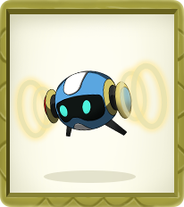

左右兩邊的部件釋放出的電磁波遮罩重力，從而懸浮在空中。 左右兩邊的部件是强力的磁鐵。 能發出足以將半徑100米以內的鐵都吸引過來的强大磁力。



| 類型  | 數值             |
| --- | -------------- |
| 屬性  | 電              |
| 稀有度 | GR             |
| 身高  | 0.3m           |
| 體重  | 6.0kg          |
| 進化  | 小磁怪→三合一磁怪→自爆磁怪 |




| 類型           | 數值   |
| ------------ | ---- |
| 戰鬥力（AKT）     | 8087 |
| 生命值（HP）      | 8100 |
| 潛力值（POT）     | 32   |
| 耐力（STA）      | 810  |
| 耐力成長（_+sta_） | 16.5 |
| 力量（STR）      | 1013 |
| 力量成長（_+str_） | 20.7 |
| 敏捷（AGI）      | 810  |
| 敏捷成長（_+agi_） | 16.5 |
| 智力（INT）      | 405  |
| 智力成長（_+int_） | 8    |
| 傷害（DAM）      | 2026 |
| 魔抗（ADF）      | 405  |
| 護甲（ARM）      | 1013 |
| 抗暴（CRE）      | 507  |
| 暴擊（CRI）      | 405  |
| 閃避（EVA）      | 162  |
| 命中（HIT）      | 405  |
| 速度（SPE）      | 810  |



| 類型 | 數值          |
| -- | ----------- |
| 蛋群 | 礦物          |
| 性別 | 雄性 : 雌性=1:1 |



| 技能名稱   | 技能描述                                    |
| ------ | --------------------------------------- |
| 電擊     | 對敵方後排單體造成120%雷屬性傷害                      |
| 電擊·Ⅰ   | 對敵方後排單體造成150%雷屬性傷害                      |
| 電擊·Ⅱ   | 對敵方後排單體造成200%雷屬性傷害                      |
| 電磁漂浮   | 對敵方後排造成90%雷屬性傷害，有概率降低目標攻擊力和護甲15%，持續2回合  |
| 電磁漂浮·Ⅰ | 對敵方後排造成110%雷屬性傷害，有概率降低目標攻擊力和護甲20%，持續2回合 |
| 電磁漂浮·Ⅱ | 對敵方後排造成130%雷屬性傷害，必定降低目標攻擊力和護甲25%，持續2回合  |



### 皮丘（Pichu） 

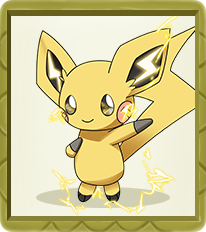

通常成群結隊，經常與其他比丘碰尾巴以示勇氣，產生的火花可以讓他們哭泣。 它不擅長儲存電力，如果被逗樂、受到驚嚇或受到電擊可能會放電。 然而，它不能在不受到電擊的情况下放電。 在乾燥的日子或有雷雨天氣時，充電更容易。 可以聽到皮丘產生的靜電劈啪聲。 它可以電擊一個成年人，但如果它這樣做了，它也會讓自己大吃一驚。



| 類型  | 數值        |
| --- | --------- |
| 屬性  | 電         |
| 稀有度 | GR        |
| 身高  | 0.3m      |
| 體重  | 2.0kg     |
| 進化  | 皮丘→皮卡丘→雷丘 |



| 類型           | 數值   |
| ------------ | ---- |
| 戰鬥力（AKT）     | 8176 |
| 生命值（HP）      | 6330 |
| 潛力值（POT）     | 32   |
| 耐力（STA）      | 633  |
| 耐力成長（_+sta_） | 12.1 |
| 力量（STR）      | 1056 |
| 力量成長（_+str_） | 20.3 |
| 敏捷（AGI)      | 887  |
| 敏捷成長（_+agi_） | 17.1 |
| 智力（INT）      | 464  |
| 智力成長（_+int_） | 8.9  |
| 傷害（DAM）      | 2112 |
| 魔抗（ADF）      | 464  |
| 護甲（ARM）      | 1056 |
| 抗暴（CRE）      | 528  |
| 暴擊（CRI）      | 444  |
| 閃避（EVA）      | 186  |
| 命中（HIT）      | 317  |
| 速度（SPE）      | 887  |



| 類型 | 數值          |
| -- | ----------- |
| 蛋群 | 陸上/妖精       |
| 性別 | 雄性 : 雌性=1:1 |



| 技能名稱   | 技能描述                                              |
| ------ | ------------------------------------------------- |
| 電擊     | 移動到敵方目標前釋放雷電，使敵方前排單體受到到180%雷屬性傷害，並降低目標護甲10%，持續2回合 |
| 電擊·Ⅰ   | 移動到敵方目標前釋放雷電，使敵方前排單體受到到210%雷屬性傷害，並降低目標護甲20%，持續2回合 |
| 電擊·Ⅱ   | 移動到敵方目標前釋放雷電，使敵方前排單體受到到240%雷屬性傷害，並降低目標護甲40%，持續2回合 |
| 電磁漂浮   | 釋放雷電光束，對敵方單體目標造成250%雷屬性傷害，高概率使目標眩暈1回合             |
| 電磁漂浮·Ⅰ | 釋放雷電光束，對敵方單體目標造成300%雷屬性傷害，高概率使目標眩暈2回合             |
| 電磁漂浮·Ⅱ | 釋放雷電光束，對敵方單體目標造成350%雷屬性傷害，必定使目標眩暈2回合              |



### 超音蝠（Zubat） 

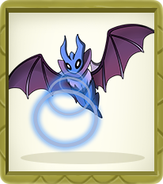

在太陽落山後才開始活動。 因為它的皮膚薄到只要被陽光照射到就會曬傷，所以白天會躲在陰暗處睡覺。 天氣變冷後，它們就會抱團取暖。



| 類型  | 數值          |
| --- | ----------- |
| 屬性  | 草           |
| 稀有度 | SSR         |
| 身高  | 0.8m        |
| 體重  | 7.5kg       |
| 進化  | 超音蝠→大嘴蝠→叉字蝠 |



| 類型           | 數值   |
| ------------ | ---- |
| 戰鬥力 (AKT)    | 3894 |
| 生命值（HP)      | 3400 |
| 潛力值 (POT)    | 16   |
| 耐力 (STA)     | 340  |
| 耐力成長（_+sta_） | 7.8  |
| 力量（STR）      | 512  |
| 力量成長（_+str_） | 10   |
| 敏捷 (AGI)     | 325  |
| 敏捷成長（_+agi_） | 6.2  |
| 智力（INT）      | 263  |
| 智力成長（_+int_） | 5    |
| 傷害（DAM）      | 1024 |
| 魔抗（ADF）      | 263  |
| 護甲（ARM）      | 512  |
| 抗暴（CRE）      | 256  |
| 暴擊（CRI）      | 163  |
| 閃避（EVA）      | 105  |
| 命中（HIT）      | 170  |
| 速度（SPE）      | 325  |



| 類型 | 數值          |
| -- | ----------- |
| 蛋群 | 飛行          |
| 性別 | 雄性 : 雌性=1:1 |



| 技能名稱  | 技能描述                              |
| ----- | --------------------------------- |
| 吸血    | 對敵方前排所有目標造成65%草屬性傷害               |
| 吸血·Ⅰ  | 對敵方前排所有目標造成80%草屬性傷害               |
| 吸血·Ⅱ  | 對敵方前排所有目標造成105%草屬性傷害              |
| 超音波   | 對敵方前排所有目標造成100%草屬性傷害，一定概率減少目標50怒氣 |
| 超音波·Ⅰ | 對敵方前排所有目標造成120%草屬性傷害，高概率減少目標50怒氣  |
| 超音波·Ⅱ | 對敵方前排所有目標造成160%草屬性傷害，必定減少目標50怒氣   |



### 小火龍（Charmander） 

它尾巴上的火焰能够表現出它的情緒。 當它開心時，火焰會搖曳。 如果它被激怒，火焰就會猛烈地燃燒。 生下來的時候，尾巴上就有火在燃燒。 當尾巴上的火熄滅時，它的生命就結束了。



| 類型  | 數值          |
| --- | ----------- |
| 屬性  | 火           |
| 稀有度 | SSR         |
| 身高  | 0.6m        |
| 體重  | 8.5kg       |
| 進化  | 小火龍→火恐龍→噴火龍 |



| 類型           | 數值   |
| ------------ | ---- |
| 戰鬥力（AKT)     | 3764 |
| 生命值（HP)      | 3450 |
| 潛力值（POT)     | 16   |
| 耐力（STA)      | 345  |
| 耐力成長（_+sta_） | 7    |
| 力量（STR）      | 225  |
| 力量成長（_+str_） | 4.4  |
| 敏捷（AGI）      | 420  |
| 敏捷成長（_+agi_） | 8.5  |
| 智力（INT）      | 450  |
| 智力成長（_+int_） | 9.3  |
| 傷害（DAM）      | 900  |
| 魔抗（ADF）      | 450  |
| 護甲（ARM）      | 225  |
| 抗暴（CRE）      | 113  |
| 暴擊（CRI）      | 210  |
| 閃避（EVA）      | 180  |
| 命中（HIT）      | 173  |
| 速度（SPE）      | 420  |



| 類型 | 數值          |
| -- | ----------- |
| 蛋群 | 怪獸/龍        |
| 性別 | 雄性 : 雌性=1:1 |




| 技能名稱   | 技能描述                                       |
| ------ | ------------------------------------------ |
| 火花     | 吐出火球，對敵方前排單體目標造成120%火屬性傷害                  |
| 火花·Ⅰ   | 吐出火球，對敵方前排單體目標造成150%火屬性傷害                  |
| 火花·Ⅱ   | 吐出火球，對敵方前排單體目標造成200%火屬性傷害                  |
| 神噴射火焰  | 噴射貫穿火焰，對敵方豎排目標造成160%火屬性傷害，並有概率造成灼燒傷害，持續3回合 |
| 噴射火焰·Ⅰ | 噴射貫穿火焰，對敵方豎排目標造成200%火屬性傷害，高概率造成灼燒傷害，持續3回合  |
| 噴射火焰·Ⅱ | 噴射貫穿火焰，對敵方豎排目標造成280%火屬性傷害，必定造成灼燒傷害，持續3回合   |



### 妙蛙種子（Bulbasaur） 

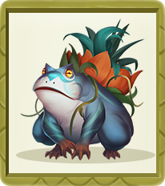

它最显著的特点就是它背后那个鳞茎状的种子，种子与蛙之间存在着共生关系，从它出生起就种子和身体一同生长了。



| 類型  | 數值           |
| --- | ------------ |
| 屬性  | 草            |
| 稀有度 | SSR          |
| 身高  | 0.7m         |
| 體重  | 6.9kg        |
| 進化  | 妙蛙種子→妙蛙草→妙蛙花 |



| 類型           | 數值   |
| ------------ | ---- |
| 戰鬥力 (AKT)    | 3823 |
| 生命值 (HP)     | 3000 |
| 潛力值 (POT)    | 16   |
| 耐力 (STA)     | 300  |
| 耐力成長（_+sta_） | 6.1  |
| 力量 (STR)     | 195  |
| 力量成長（_+str_） | 4    |
| 敏捷 (AGI)     | 465  |
| 敏捷成長（_+agi_） | 9.4  |
| 智力（INT）      | 480  |
| 智力成長（_+int_） | 9.7  |
| 傷害（DAM）      | 960  |
| 魔抗（ADF）      | 480  |
| 護甲（ARM）      | 195  |
| 抗暴（CRE）      | 98   |
| 暴擊（CRI）      | 233  |
| 閃避（EVA）      | 192  |
| 命中（HIT）      | 150  |
| 速度（SPE）      | 465  |



| 類型 | 數值          |
| -- | ----------- |
| 蛋群 | 怪獸/植物       |
| 性別 | 雄性 : 雌性=1:1 |



| 技能名稱   | 技能描述                                                   |
| ------ | ------------------------------------------------------ |
| 藤鞭     | 召喚藤鞭，對敵方後排單體目標造成120%草屬性傷害                              |
| 藤鞭·Ⅰ   | 召喚藤鞭，對敵方後排單體目標造成150%草屬性傷害                              |
| 藤鞭·Ⅱ   | 召喚藤鞭，對敵方後排單體目標造成180%草屬性傷害                              |
| 飛葉快刀   | 移動到敵方陣容中間，召喚飛旋的葉子，對敵方隨機4個目標造成120%草屬性傷害                 |
| 飛葉快刀·Ⅰ | 移動到敵方陣容中間，召喚飛旋的葉子，對敵方隨機5個目標造成150%草屬性傷害                 |
| 飛葉快刀·Ⅱ | 對敵方全體造成160%火屬性傷害，必移動到敵方陣容中間，召喚飛旋的葉子，對敵方全體目標造成180%草屬性傷害 |



### 鬼斯（Gastly） 

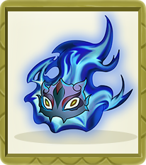

它能够通過用有毒氣體將其包圍起來在兩秒鐘內使一頭印度象倒下。 在有些偶然情况下，它會得到像人一樣說話的能力並能够轉變它自己的形態。 它可以用心電感應來交流，還能够製造幻影、變身為少女或老婆婆，以及與死亡者的靈魂溝通。



| 類型  | 數值        |
| --- | --------- |
| 屬性  | 變異        |
| 稀有度 | SSR       |
| 身高  | 1.3m      |
| 體重  | 0.1kg     |
| 進化  | 鬼斯→鬼斯通→耿鬼 |



| 類型           | 數值   |
| ------------ | ---- |
| 戰鬥力（AKT）     | 3869 |
| 生命值（HP）      | 3200 |
| 潛力值 (POT）    | 16   |
| 耐力（STA）      | 320  |
| 耐力成長（_+sta_） | 7.3  |
| 力量（STR）      | 520  |
| 力量成長（_+str_） | 10.6 |
| 敏捷（AGI)      | 300  |
| 敏捷成長（_+agi_） | 6.3  |
| 智力（INT）      | 280  |
| 智力成長（_+int_） | 25   |
| 傷害（DAM）      | 1040 |
| 魔抗（ADF）      | 280  |
| 護甲（ARM）      | 520  |
| 抗暴（CRE）      | 260  |
| 暴擊（CRI）      | 150  |
| 閃避（EVA）      | 112  |
| 命中（HIT）      | 160  |
| 速度（SPE）      | 300  |



| 類型 | 數值          |
| -- | ----------- |
| 蛋群 | 不定型         |
| 性別 | 雄性 : 雌性=1:1 |



| 技能名稱  | 技能描述                       |
| ----- | -------------------------- |
| 影擊    | 對敵方前排單體造成90%的變異屬性傷害        |
| 影擊·Ⅰ  | 對敵方前排單體造成110%的變異屬性傷害       |
| 影擊·Ⅱ  | 對敵方前排單體造成150%的變異屬性傷害       |
| 鬼影斬   | 對敵方生命值最低的寵物造成180%的變異屬性傷害   |
| 鬼影斬·Ⅰ | 對敵方生命值最低的寵物造成220%的變異屬性傷害   |
| 鬼影斬·Ⅱ | 對敵方生命值最低的2個寵物造成260%的變異屬性傷害 |



### 卡拉卡拉（Cubone） 

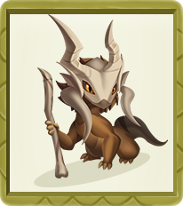

一直戴著已經去世的母親的頭蓋骨，所以不清楚其真實面貌是怎樣的。 悲傷和寂寞時戴著的頭蓋骨會擺動發出短暫悲傷的聲音。 據說它與袋龍有關係，疑似是袋龍的寶寶。



| 類型  | 數值              |
| --- | --------------- |
| 屬性  | 水               |
| 稀有度 | SR              |
| 身高  | 0.4m            |
| 體重  | 6.5g            |
| 進化  | 卡拉卡拉→嘎啦嘎啦→嘎啦嘎啦X |



| 類型           | 數值  |
| ------------ | --- |
| 戰鬥力（AKT）     | 819 |
| 生命值（HP）      | 830 |
| 潛力值（POT）     | 7   |
| 耐力（STA）      | 83  |
| 耐力成長（_+sta_） | 3.5 |
| 力量 (STR）     | 70  |
| 力量成長（_+str_） | 2.4 |
| 敏捷（AGI）      | 78  |
| 敏捷成長（_+agi_） | 2.9 |
| 智力（INT）      | 90  |
| 智力成長（_+int_） | 4   |
| 傷害（DAM）      | 180 |
| 魔抗（ADF）      | 90  |
| 護甲（ARM）      | 70  |
| 抗暴（CRE）      | 35  |
| 暴擊（CRI）      | 39  |
| 閃避（EVA）      | 36  |
| 命中（HIT）      | 42  |
| 速度（SPE）      | 78  |



| 類型 | 數值          |
| -- | ----------- |
| 蛋群 | 怪獸          |
| 性別 | 雄性 : 雌性=1:1 |



| 技能名稱   | 技能描述             |
| ------ | ---------------- |
| 火焰輪    | 對敵方後排造成105%的火焰傷害 |
| 火焰輪·Ⅰ  | 對敵方後排造成145%的火焰傷害 |
| 火焰輪·Ⅱ  | 對敵方後排造成195%的火焰傷害 |
| 烈焰濺射   | 對敵方全體造成100%火屬性傷害 |
| 烈焰濺射·Ⅰ | 對敵方全體造成120%火屬性傷害 |
| 烈焰濺射·Ⅱ | 對敵方全體造成150%火屬性傷害 |



### 凱西（Abra） 

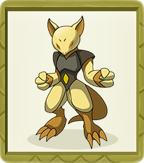

它可以通過心靈感應雷達感知危險。 當它這樣做時，它會傳送到一個安全的位置。 然而，如果它在一個未知的位置醒來，它有時會變得恐慌。 通過對自己進行催眠，它甚至可以在睡覺時傳送自己。 它也可以在睡覺時使用其他超感官能力，甚至可以傳送到樹梢上採摘和吃漿果。 睡得越深，傳送得越遠。 然而，由於其心靈感應能力的緊張，它每天睡18個小時。 如果它不能休息足够長的時間，它將無法使用它的力量。 它的夢境中的內容會影響它的力量。



| 類型  | 數值       |
| --- | -------- |
| 屬性  | 超能力      |
| 稀有度 | SR       |
| 身高  | 0.9m     |
| 體重  | 19.5kg   |
| 進化  | 凱西→勇煌→胡地 |



| 類型           | 數值  |
| ------------ | --- |
| 戰鬥力（AKT）     | 823 |
| 生命值（HP）      | 730 |
| 潛力值（POT）     | 7   |
| 耐力 (STA）     | 73  |
| 耐力成長（_+sta_） | 3.5 |
| 力量（STR）      | 91  |
| 力量成長（_+str_） | 3.8 |
| 敏捷（AGI）      | 87  |
| 敏捷成長（_+agi_） | 2.9 |
| 智力（INT）      | 69  |
| 智力成長（_+int_） | 2.6 |
| 傷害（DAM）      | 182 |
| 魔抗（ADF）      | 69  |
| 護甲（ARM）      | 91  |
| 抗暴（CRE）      | 46  |
| 暴擊（CRI）      | 44  |
| 閃避（EVA）      | 28  |
| 命中（HIT）      | 37  |
| 速度（SPE）      | 87  |



| 類型 | 數值          |
| -- | ----------- |
| 蛋群 | 人型          |
| 性別 | 雄性 : 雌性=1:1 |



| 技能名稱   | 技能描述                               |
| ------ | ---------------------------------- |
| 精神衝擊   | 對敵方單體發動110%超能力攻擊                   |
| 精神衝擊·Ⅰ | 對敵方單體發動130%超能力攻擊                   |
| 精神衝擊·Ⅱ | 對敵方單體發動160%超能力攻擊                   |
| 精神轉移   | 對敵方豎排目標造成120%超能力係傷害，並低概率使敵人無法使用怒氣技 |
| 精神轉移·Ⅰ | 對敵方豎排目標造成150%超能力係傷害，並低概率使敵人無法使用怒氣技 |
| 精神轉移·Ⅱ | 對敵方豎排目標造成200%超能力係傷害，並低概率使敵人無法使用怒氣技 |



### 波加曼（Piplup） 

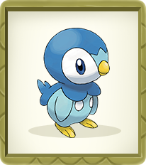

它有强烈的自尊心。 由於它的驕傲，它很難接受人類的食物並與它的看護者建立聯系。 它甚至會在跌倒後挺起胸膛，這是由於它的行走能力差而經常這樣做的。 然而，它是一個熟練的游泳者，可以潜水十多分鐘才能打獵。



| 類型  | 數值           |
| --- | ------------ |
| 屬性  | 水            |
| 稀有度 | R            |
| 身高  | 0.4m         |
| 體重  | 5.2kg        |
| 進化  | 波加曼→波皇子→帝王拿波 |



| 類型           | 數值  |
| ------------ | --- |
| 戰鬥力（AKT）     | 513 |
| 生命值（HP）      | 560 |
| 潛力值（POT）     | 4   |
| 耐力（STA）      | 56  |
| 耐力成長（_+sta_） | 2.3 |
| 力量（STR）      | 42  |
| 力量成長（_+str_） | 1.4 |
| 敏捷（AGI）      | 44  |
| 敏捷成長（_+agi_） | 1.5 |
| 智力（INT）      | 58  |
| 智力成長（_+int_） | 2.4 |
| 傷害（DAM）      | 116 |
| 魔抗（ADF）      | 58  |
| 護甲（ARM）      | 42  |
| 抗暴（CRE）      | 21  |
| 暴擊（CRI）      | 22  |
| 閃避（EVA）      | 23  |
| 命中（HIT）      | 28  |
| 速度（SPE）      | 44  |



| 類型 | 數值          |
| -- | ----------- |
| 蛋群 | 水中/陸上       |
| 性別 | 雄性 : 雌性=1:1 |



| 技能名稱  | 技能描述                    |
| ----- | ----------------------- |
| 怒擊    | 吐出水箭，對敵方單體造成100%的水屬性傷害  |
| 怒擊·Ⅰ  | 對吐出水箭，對敵方單體造成130%的水屬性傷害 |
| 怒擊·Ⅱ  | 吐出水箭，對敵方單體造成170%的水屬性傷害  |
| 水流箭   | 對目標後排造成100%水屬性傷害        |
| 水流箭·Ⅰ | 對目標後排造成120%水屬性傷害        |
| 水流箭·Ⅱ | 對目標後排造成150%水屬性傷害        |



### 蚊香蝌蚪（Poliwag） 

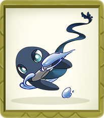

它有一條細長的尾巴，周圍環繞著淡藍色、半透明的鰭。 它的尾巴使它成為一個强大的游泳者。 儘管有危險，它喜歡在陸地上蹣跚而行。 然而，如果它看到危險，它會很快回到水中。 除非每天訓練，否則它不能很好地在陸地上行走。



| 類型  | 數值            |
| --- | ------------- |
| 屬性  | 水             |
| 稀有度 | N             |
| 身高  | 0.6m          |
| 體重  | 12.4kg        |
| 進化  | 蚊香蝌蚪→蚊香君→蚊香泳士 |



| 類型           | 數值  |
| ------------ | --- |
| 戰鬥力（AKT）     | 210 |
| 生命值（HP）      | 220 |
| 潛力值 (POT）    | 2   |
| 耐力 (STA）     | 22  |
| 耐力成長（_+sta_） | 1.5 |
| 力量（STR）      | 15  |
| 力量成長（_+str_） | 1.2 |
| 敏捷（AGI）      | 18  |
| 敏捷成長（_+agi_） | 1.3 |
| 智力（INT）      | 25  |
| 智力成長（_+int_） | 1.6 |
| 傷害（DAM）      | 50  |
| 魔抗（ADF）      | 25  |
| 護甲（ARM）      | 15  |
| 抗暴（CRE）      | 8   |
| 暴擊（CRI）      | 9   |
| 閃避（EVA）      | 10  |
| 命中（HIT）      | 11  |
| 速度（SPE）      | 18  |



| 類型 | 數值          |
| -- | ----------- |
| 蛋群 | 水中          |
| 性別 | 雄性 : 雌性=1:1 |



| 技能名稱  | 技能描述                    |
| ----- | ----------------------- |
| 怒擊    | 吐出水箭，對敵方單體造成100%的水屬性傷害  |
| 怒擊·Ⅰ  | 對吐出水箭，對敵方單體造成130%的水屬性傷害 |
| 怒擊·Ⅱ  | 吐出水箭，對敵方單體造成170%的水屬性傷害  |
| 水流箭   | 對目標後排造成100%水屬性傷害        |
| 水流箭·Ⅰ | 對目標後排造成120%水屬性傷害        |
| 水流箭·Ⅱ | 對目標後排造成150%水屬性傷害        |



### 綠毛蟲（Caterpie） 

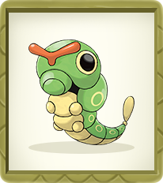

隨著時間的推移，它會不斷地成長和發育，它會多次蛻皮，最後才將自己包裹在厚厚的蠶絲中。 它食欲旺盛，一天要吃一百片葉子。 它甚至會吃比自己大的葉子。 它最喜歡的食物是朱紅色花。 它生活在溫帶森林和叢林中。



| 類型  | 數值          |
| --- | ----------- |
| 屬性  | 草           |
| 稀有度 | N           |
| 身高  | 0.3m        |
| 體重  | 2.9kg       |
| 進化  | 綠毛蟲→鐵甲蛹→巴大蝶 |



| 類型           | 數值  |
| ------------ | --- |
| 戰鬥力（AKT）     | 210 |
| 生命值（HP）      | 220 |
| 潛力值（POT）     | 2   |
| 耐力（STA）      | 22  |
| 耐力成長（_+sta_） | 1.5 |
| 力量（STR)      | 15  |
| 力量成長（_+str_） | 1.2 |
| 敏捷（AGI）      | 18  |
| 敏捷成長（_+agi_） | 1.3 |
| 智力（INT）      | 25  |
| 智力成長（_+int_） | 1.6 |
| 傷害（DAM）      | 50  |
| 魔抗（ADF）      | 25  |
| 護甲（ARM）      | 15  |
| 抗暴（CRE）      | 8   |
| 暴擊（CRI）      | 9   |
| 閃避（EVA）      | 10  |
| 命中（HIT）      | 11  |
| 速度（SPE）      | 18  |



| 類型 | 數值          |
| -- | ----------- |
| 蛋群 | 蟲           |
| 性別 | 雄性 : 雌性=1:1 |



| 技能名稱  | 技能描述                             |
| ----- | -------------------------------- |
| 木角    | 對敵方單體造成80%地屬性傷害                  |
| 木角·Ⅰ  | 對敵方單體造成100%地屬性傷害                 |
| 木角·Ⅱ  | 對敵方單體造成120%地屬性傷害                 |
| 刃葉斬   | 對敵方單體造成120%地屬性傷害，命中要害，降低目標20%防禦力 |
| 刃葉斬·Ⅰ | 對敵方單體造成130%地屬性傷害，命中要害，降低目標20%防禦力 |
| 刃葉斬·Ⅱ | 對敵方單體造成150%地屬性傷害，命中要害，降低目標20%防禦力 |



### &#x20;
