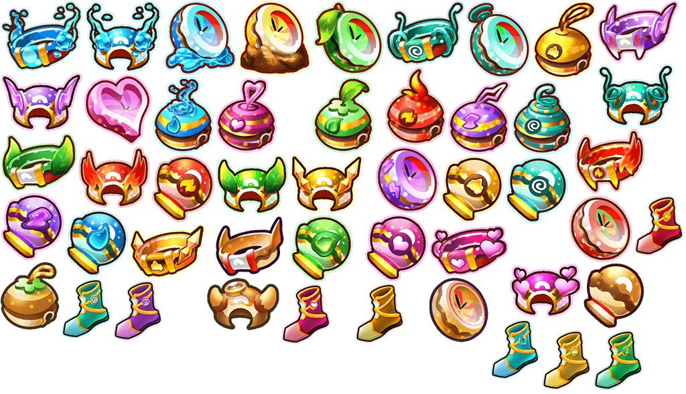
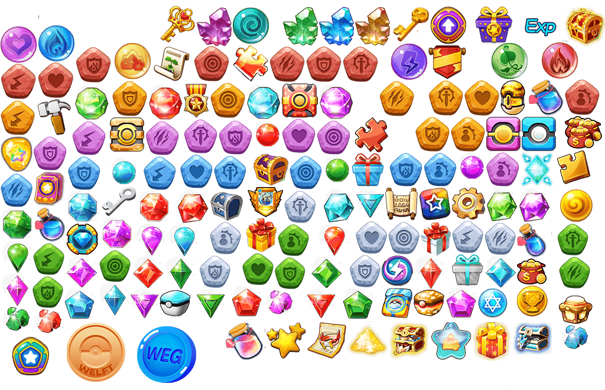

# 背包

**裝備**

精靈可以佩戴項圈、手套、頭飾、鈴鐺、碼錶、靴子等，一共有6個裝備部件，每個部件都是所有精靈通用的。裝備可以提升精靈的護甲、傷害、暴擊、魔抗、抗爆、閃避等作用，每件裝備最多可以提升2個常規能力。

裝備分為5個品質等級：白色<綠色<藍色<紫色<橙色（圖示周圍有光環），其中只有橙色裝備可以升級。每次升級都需要消耗禮券，禮券根據裝備等級而定。背包中非橙色裝備可以一鍵熔煉，祭壇吞噬裝備，然後彈出熔煉強化石和WEG。

#### **道具**

| 道具名稱                | 用途                                                           | 描述                                                                                                                   |
| ------------------- | ------------------------------------------------------------ | -------------------------------------------------------------------------------------------------------------------- |
| Fortified Stone     | Equip boosters                                               | Can be purchased in the shop, or smelt equipment, treasure hunt, etc.                                                |
| God Metal           | Equipment Refinement Items                                   | It can be purchased in the shop, or can be obtained in event dungeons and challenge high-level world bosses          |
| Coupon              | Redeem and synthesize orange equipment                       | Can be obtained from world bosses, treasure hunts, and event levels                                                  |
| Activity            | Redeem active mission rewards                                | The reward value when the daily task is completed, you can receive the activity package according to the fixed value |
| WEP                 | Consumables                                                  | Used for system consumption such as equipment strengthening, refining, elf evolution, star upgrade, etc.             |
| WELFT               | Consumables                                                  | Buy items from the fair, purchases, etc.                                                                             |
| Sweeping Scroll     | Raid Rlite Instance                                          | Buy it at the shop, or get it by collecting welfare packages, etc.                                                   |
| Punch Hammer        | Gem hole punching                                            | Available in the shop                                                                                                |
| Badge Essence       | Badge upgrades and breakthrough props                        | Available in the shop                                                                                                |
| Easter Stone        | Resurrection of the fallen elves during the expedition       | Can be obtained by opening treasure chests in expeditions                                                            |
| Treasure Hunt Order | Treasure Hunt Props                                          | Treasure hunt for rare equipment                                                                                     |
| Key                 | Key to open treasure chest                                   | It can be purchased in the shop, or obtained through other means such as welfare activities                          |
| Reward Box          | Get equipment, a certain probability to get orange equipment | Reward Box in Damage Ranking                                                                                         |
| Orange Box          | Equipment available in orange                                | Orange Boxe in World Bosses                                                                                          |
| Gem box             | Get a random gem                                             | The treasure chest box                                                                                               |

#### Gem

| Gem Name | Application                  | Description                                                                                        |
| -------- | ---------------------------- | -------------------------------------------------------------------------------------------------- |
| STA Gem  | Can be embedded in equipment | Increase the stamina (STA) attribute, buy it in the shop, or challenge the gem land to get it      |
| STR Gem  | Can be embedded in equipment | Increase the strength (STR) attribute, buy it in the shop, or challenge the gem land to get it     |
| AGI Gem  | Can be embedded in equipment | Increase the agility (AGI) attribute, buy it in the shop, or challenge the gem land to get it      |
| INT Gem  | Can be embedded in equipment | Increase the intelligence (INT) attribute, buy it in the shop, or challenge the gem land to get it |
