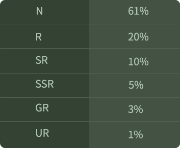

# 精靈球

精靈球是一款收集精靈的遊戲道具。該過程具有隨機屬性。根據遊戲屬性的不同，您將獲得不同稀有度的精靈。

總共有9000個創世精靈球，其中8000個是通過購買盲盒生成的。其中，4000個創世精靈球每顆花費0.2BNB，其餘4000個創世精靈球使用ELFT購買。每個位址最多可以購買10個創世精靈球。其他1000個創世精靈球是在遊戲後期通過遊戲內探索生成的。

#### **稀有度**

創世精靈球中以下稀有度分佈：

**稀有度等級一般為:** UR >GR > SSR > SR > R > N.

| 縮寫  | 英文名稱                | 中文名稱 |
| --- | ------------------- | ---- |
| N   | Normal              | 普通   |
| R   | Rare                | 稀有   |
| SR  | Super Rare          | 超稀有  |
| SSR | Superior Super Rare | 超級稀有 |
| GR  | Gold Rare           | 罕貴稀有 |
| UR  | Ultra Rare          | 極度稀有 |

精靈按性別分為雌性和雄性兩類，雌雄比例為1：1。
