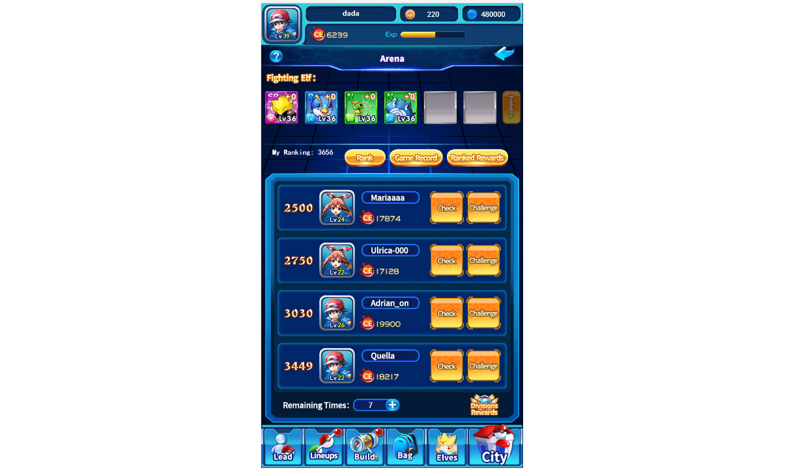

# 聯盟大賽（預）

#### **競技場**

競技場是玩家展現自身實力的系統，玩家通過挑戰比自己排名高的玩家，逐漸提升自己的名次，獲取相應的獎勵。

玩家排名在1-5名：對手為前5名玩家；

玩家排名在6-20名：對手為比自己排名高4的玩家；

玩家排名在21-50名：從比玩家排名高10的玩家中隨機抽取4個；

玩家排名在51-500名：從比玩家排名高20的玩家中隨機抽取4個；

玩家排名在500名以外：從比玩家排名高50的玩家中隨機抽取4個；

當排名低於對手，戰勝挑戰對手後，將與對手排名進行互換。若戰鬥失敗，則排名保持不變。

當排名高於對手，戰勝挑戰對手後，排名保持不變。若戰鬥失敗，則排名保持不變。
